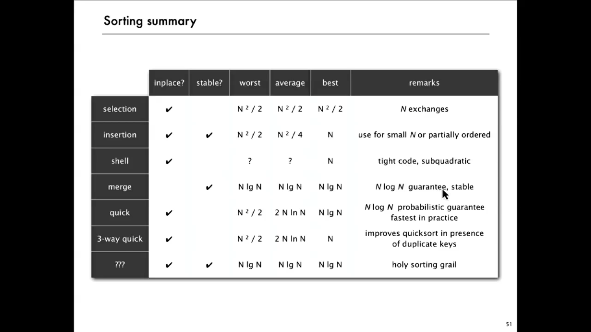

# Algorithms and Data Structures Study

## What to Know

+ [**Data Structures**](./data_structures/README.md)
    + [Linked List](./data_structures/linked_lists)
    + [Binary Search Tree](./data_structures/binary_search_tree/README.md)
    + Tries
    + Graphs
    + [Stacks](./data_structures/stack/README.md)
    + Queues
    + [Heaps](./data_structures/heap/README.md)
    + [Vectors / ArrayLists](./data_structures/arrays)
    + [Hash Tables](./data_structures/hash_tables/README.md)
+ **Algorithms**
    + Breadth-First Search
    + Depth-First Search
    + [Binary Search](./data_structures/arrays/code_rust/binary_search/README.md)
    + [Merge Sort](./algorithms/merge_sort/README.md)
    + Quick Sort
+ **Concepts**
    + [Bit Manipulation](./concepts/bitwise_operators/README.md)
    + Memory (Stack vs. Heap)
    + [Recursion](./concepts/recursion/README.md)
    + Dynamic Programming
    + [Big O Time and Space](./big_o/README.md)
    + [Object Oriented Design](./concepts/object_oriented_design/README.md)
+ **Math**
    + [Counting Principle, Permutations and Combinations](./math/counting_principle_permutations_combinations/README.md)
    + [Palindrome](./math/palindrome/README.md)
    + [Subsets of a set](./subsets/README.md)
    + [Probability](./math/probability.README.md)
    + [Sum of first N natural numbers](./math/sum_first_n_natural_numbers/README.md)
    + [Slope of a line and derivative](./math/slope/README.md)
    + [Distance Formula](./math/distance_formula/README.md)
    + [Prime Numbers](./math/prime_numbers)
    + [Pigeonhole Principle](./math/pigeonhole_principle/README.md)
    + [LCM and GCD](./math/lcm_and_gcd/README.md)
    + [Inclusion Exclusion Principle](./math/inclusion_exclusion_principle/README.md)
    + [Decimal and Binary](./math/decimal_and_binary/README.md)
    + [Hexadecimal](./math/hexadecimal/README.md)
    + [Solving a quadratic equation](./math/solve_quadratic_equations_using_quadratic_formula/README.md)
    + [Mean, Median, and Mode](./math/mean_median_and_mode/README.md)

## Sorting

### Criteria to Consider

+ How much data is to be sorted?
  + For small data sets it doesn't matter which algorithm you choose because there is little difference in the execution times.
    + Although Mergesort can be implement
+ Does the data fit into memory?
  + If the data set is too large for memory, you may need to split it into smaller chunks for sorting and then combine those sorted chunks to create a the final sorted data set.
+ Is the data already mostly sorted?
  + Adding new data to a sorted list can be done efficiently with certain algorithms, but those same algorithms have poor performance on randomly ordered data.
  + For partially ordered arrays we may not need Nlog(N) compares.
  + For duplicate keys we may not need Nlog(N) compares.
+ How much additional memory does the algorithm require?
  + An *in-place* sorting algorithm sorts the data without using any additional memory.
+ Is relative order preserved?
  + A *stable* sorting algorithm preserves the relative order of data elements that are otherwise identical for sorting purposes.
  + Stability is generally a desirable feature, but in many cases it may be worth sacrificing stability for improved performance.
    + **Stable Sorting Algorithms**
      + Insertion Sort
      + Mergesort
    + **Unstable Sorting Algorithms**
      + Selection Sort
      + Quicksort

Applications have diverse attributes.

+ Stable?
+ Parallel?
+ Deterministic?
+ Keys all distinct?
+ Multiple key types?
+ Linked list or arrays?
+ Large or small items?
+ Is your array randomly ordered?
+ Need guaranteed performance?

### Selection Sort

+ In iteration `i`, find index `min` of smallest remaining entry.
+ Swap `a[i]` and `a[min]`

1. Find the smallest
2. Swap `a[i]` and `a[min]`
3. Increment `i`

Selection sort **does not care** if the array is partially sorted.

### Insertion Sort

+ In iteration `i`, swap `a[i]` with each larger entry to its left.
+ Increment `i`

**Does depend on the initial order of the data**

Best Case: If the array is in ascending order, insertion sort makes `N-1` compares and 0 exchanges. If the array is partially sorted, insertion sort runs in linear time.

Worst Case: If the array is in descending order (and no duplicates), insertion sort makes ~ `(N^2)/2` compares and ~ `(N^2)/2` exchanges.

### Mergesort

+ Divide array into two halves.
+ Recursively sort each half.
+ Merge two halves.
  + Given two sorted subarrays, take two pointers to the two subarrays, compare their values, and take the min. Increment the pointer pointing to the min that was just taken.

Mergesort uses at most `Nlog(N)` compares and `6Nlog(N)` array accesses to sort any array of size `N`.

Mergesort uses extra space proportional to `N`. The array needs to be of size `N` for the last merge.

We **can** use **Insertion Sort** for small subarray. Mergesort has too much overhead for tiny subarrays. Cutoff to insertion sort for ~ 7 items.

We **can** stop if the the array is aleady sorted. Is the biggest itemin the first half <= smallest item in second half? This helps for partially-sorted arrays.

### Quicksort

1. Randomly shuffle the array
2. Partition so that, for some `j`
   + entry `a[j]` is in place
   + no larger entry to the left of `j`
   + no smaller entry to the right of `j`
3. Sort each piece recursively

#### Partitioning
1. Repeat until `i` and `j` pointers cross
   + Scan `i` from left to right so long as (`a[i] < a[lo]`)
   + Scan `j` from right to left so long as (`a[j] > a[lo]`)
   + Exchange `a[i]` with `a[j]`
2. When pointers cross, exchange `a[lo]` with `a[j]`

#### Implementation Details
1. Partitioning in-place.
   + Using an extra array makes partitioning easier (and stable) but is not worth the cost.
2. Terminating the loop
   + Testing whether the pointers cross is a bit trickier than it might seem.
3. Staying in bounds
   + The `(j == lo)` test is redundant because the iteration will stop when it hits the partitioning element but the `(i == hi)` test is not.
4. Preserving Randomness
   + Shuffling is needed for performance guarantee.
5. Equal Keys
   + When duplicates are present, it is (counter-intuitively) better to stop on keys equal to the partitioning item's key.

Best case: `Nlog(N)`

Worst case: `(N^2)/2` if the random shuffle puts the items exactly in order. Or if all items equal to the partitioning item are on one side (duplicates)

Random shuffle provides a probabilistic guarantee against worst case.

Quicksort **can** run in quadratic time if there are a number of duplicates and the implementation is not done just right.

#### Properties
1. Quicksort is an in-place sorting algorithm
   + Partitioning: constant extra space.
   + Depth of recursion: logarithmic extra space (with high probability).
2. Quicksort is **not** stable
   + Partitioning does a long range exchange.

#### Practical Improvements
1. Even quicksort has too much overhead for tiny subarrays.
2. Cutoff to insertion sort for ~ 10 items.
3. Note: could delay insertion sort until one pass at end.

1. Median of Sample
   + Best choice of pivot item ~ median
   + Estimate true median by taking median of sample
   + Median-of-3 (random) items.

#### Beating Duplication
3-way partitioning

1. Partition array into 3 parts so that:
   + Entries between `lt` and `gt` equal to partition item `v`. Middle partition
   + No larger entries to left of `lt`. Lower partition
   + No smaller entries to right of `gt`. Greater partition

Implementation:

1. Let `v` be partitioning item `a[lo]`
2. Scan `i` from left to right
   + `(a[i] < v)`: exchange `a[lt]` with `a[i]`; increment both `lt` and `i`
   + `(a[i] > v)`: exchange `a[gt]` with `a[gt]`; decrement `gt`
   + `(a[i] == v)`: increment `i`
